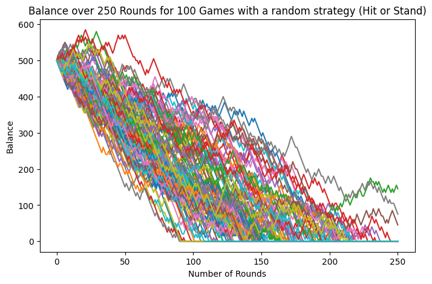

### Simulation of basic strategy on a game with 3 rounds


```python
game = BlackjackGame(min_bet=10, initial_bet=10, num_decks=6, reshuffle_pct=80)
balance = 1000

for _ in range(3):
    result, info = game.play_round(basic_strategy)
    balance += result
    info = f"ROUND {_+1}\n" + info
    info += f"New balance: {balance}\n"
    info += "-" * 20 + '\n'
    print(info)
```

    ROUND 1
    Player's hand: Hand([5 of Diamonds, 7 of Diamonds])
    Dealer's hand: 4 of Hearts and [Hidden]
    
    Dealer's hand: Hand([4 of Hearts, 10 of Hearts, K of Clubs])
    
    Player wins with 12 against dealer's 24
    New balance: 1010
    --------------------
    
    ROUND 2
    Player's hand: Hand([7 of Diamonds, Q of Spades])
    Dealer's hand: 7 of Hearts and [Hidden]
    
    Dealer's hand: Hand([7 of Hearts, 5 of Hearts, 8 of Clubs])
    
    Dealer wins with 20 against player's 17
    New balance: 1000
    --------------------
    
    ROUND 3
    Player's hand: Hand([3 of Diamonds, 3 of Hearts])
    Dealer's hand: 7 of Hearts and [Hidden]
    Player splits: Hand([3 of Diamonds, 8 of Diamonds]) and Hand([3 of Hearts, Q of Diamonds])
    
    Player's hand: Hand([3 of Diamonds, 8 of Diamonds])
    Dealer's hand: 7 of Hearts and [Hidden]
    Player doubles: Hand([3 of Diamonds, 8 of Diamonds, 7 of Clubs])
    
    Player's hand: Hand([3 of Hearts, Q of Diamonds])
    Dealer's hand: 7 of Hearts and [Hidden]
    Player hits: Hand([3 of Hearts, Q of Diamonds, 4 of Hearts])
    
    Dealer's hand: Hand([7 of Hearts, 2 of Diamonds, 8 of Hearts])
    
    Player wins with 18 against dealer's 17
    Push with 17
    New balance: 1020
    --------------------
    
    

### Monte-carlo simulation for 100 games with 250 rounds


- With a randomized strategy : 


```python
rd_balance_histories, rd_gain_histories, rd_infos = simulate_monte_carlo(
    random_strategy, initial_balance=500, num_rounds_per_game=250
)


plt.figure(figsize=(8, 5))

for i, balance_history in enumerate(rd_balance_histories):
    plt.plot(balance_history, label=f'Game {i+1}')

plt.xlabel('Number of Rounds')
plt.ylabel('Balance')
plt.title('Balance over 250 Rounds for 100 Games with a random strategy (Hit or Stand)')
plt.show()
```


    

    


```python
gains_array = np.array(rd_gain_histories)

mean_gain_rd = np.mean(gains_array, axis=1)
esperance_rd = np.mean(mean_gain_rd)

print("The average earnings expectation per round is", np.round(esperance_rd, 5) , '$ with a 10 $ bet with a random strategy')
```

    The average earnings expectation per round is -3.0284 $ with a 10 $ bet with a random strategy
    

the player quickly loses his initial bet with a random strategy by chosing randomly hit or still.

- With the basic strategy : 


```python
basic_balance_histories, basic_gain_histories, basic_infos = simulate_monte_carlo(
    basic_strategy, initial_balance=500, num_games= 1000, num_rounds_per_game=250
)

plt.figure(figsize=(8, 5))

for i, balance_history in enumerate(basic_balance_histories):
    plt.plot(balance_history, label=f'Game {i+1}')

plt.xlabel('Number of Rounds')
plt.ylabel('Balance')
plt.title('Balance over 250 Rounds for 1000 Games with basic strategy')
plt.show()
```


    

    


```python
gains_array = np.array(basic_gain_histories)

mean_gain_rd = np.mean(gains_array, axis=1)
esperance_rd = np.mean(mean_gain_rd)

print("The average earnings expectation per round is :", np.round(esperance_rd, 5) , '$ with a 10 $ bet with the basic strategy')
```

    The average earnings expectation per round is : -0.08364 $ with a 10 $ bet with the basic strategy
    

The simulations above show that the mathematical expectation is still negative despite the use of a basic strategy, demonstrating that the Casino still has the advantage. 
